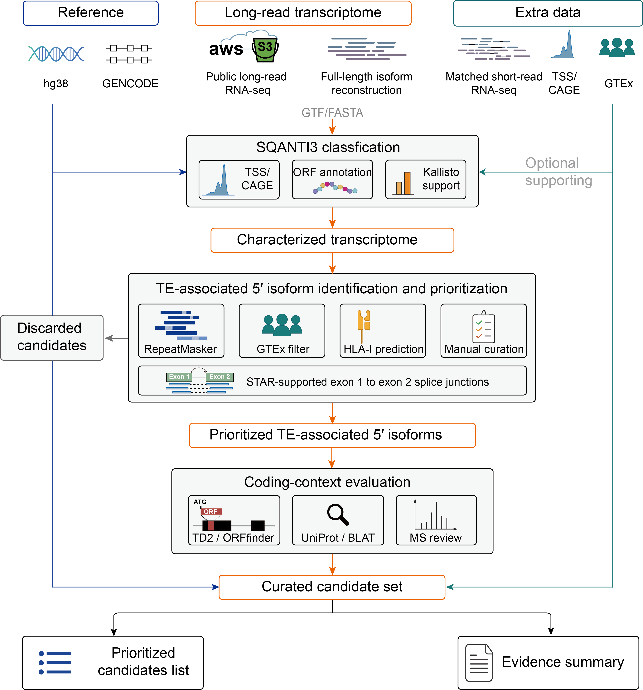

# TE5primeIsoforms

Analysis code and processed data for TE-associated 5′ isoforms and their potential coding products in cancer cell lines.

## Workflow



The analysis starts from public PacBio Iso-Seq datasets and integrates transcript structure annotation, repeat annotation, transcription start site evidence, matched short-read RNA-seq, coding-sequence analysis, peptide prediction, and complementary mass spectrometry evidence.

## Repository structure

```text
TE5primeIsoforms/
├── scripts/
│   ├── 01_pbmm2.sh
│   ├── 02_collapse.sh
│   ├── 03_sqanti3.sh
│   ├── ...
│   └── 18_dedup_orf_vs_uniprot.py
│
├── figures/
│   └── workflow.png
│
└── README.md
